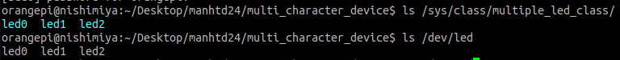

# Multiple leds controller
## Board use
* Orange pi zero 2W

## Preparation
* Build module using `make`
* Load module into kernel `sudo insmod leds_controller.ko`
* Connect led GND to GND on board, and 3 Vdd to pin 33, 35, 37.
* Initial state of led is `off`
* `gpio readall` shows the pin and its GPIO mapping on Orange pi zero 2W:

```
 +------+-----+----------+--------+---+  ZERO2W  +---+--------+----------+-----+------+
 | GPIO | wPi |   Name   |  Mode  | V | Physical | V |  Mode  | Name     | wPi | GPIO |
 +------+-----+----------+--------+---+----++----+---+--------+----------+-----+------+
 |      |     |     3.3V |        |   |  1 || 2  |   |        | 5V       |     |      |
 |  264 |   0 |    SDA.1 |    OFF | 0 |  3 || 4  |   |        | 5V       |     |      |
 |  263 |   1 |    SCL.1 |    OFF | 0 |  5 || 6  |   |        | GND      |     |      |
 |  269 |   2 |     PWM3 |    OFF | 0 |  7 || 8  | 0 | ALT2   | TXD.0    | 3   | 224  |
 |      |     |      GND |        |   |  9 || 10 | 0 | ALT2   | RXD.0    | 4   | 225  |
 |  226 |   5 |    TXD.5 |    OFF | 0 | 11 || 12 | 0 | OFF    | PI01     | 6   | 257  |
 |  227 |   7 |    RXD.5 |    OFF | 0 | 13 || 14 |   |        | GND      |     |      |
 |  261 |   8 |    TXD.2 |    OFF | 0 | 15 || 16 | 0 | OFF    | PWM4     | 9   | 270  |
 |      |     |     3.3V |        |   | 17 || 18 | 0 | OFF    | PH04     | 10  | 228  |
 |  231 |  11 |   MOSI.1 |    OFF | 0 | 19 || 20 |   |        | GND      |     |      |
 |  232 |  12 |   MISO.1 |    OFF | 0 | 21 || 22 | 0 | OFF    | RXD.2    | 13  | 262  |
 |  230 |  14 |   SCLK.1 |    OFF | 0 | 23 || 24 | 0 | OFF    | CE.0     | 15  | 229  |
 |      |     |      GND |        |   | 25 || 26 | 0 | OFF    | CE.1     | 16  | 233  |
 |  266 |  17 |    SDA.2 |    OFF | 0 | 27 || 28 | 0 | OFF    | SCL.2    | 18  | 265  |
 |  256 |  19 |     PI00 |    OFF | 0 | 29 || 30 |   |        | GND      |     |      |
 |  271 |  20 |     PI15 |    OFF | 0 | 31 || 32 | 0 | OFF    | PWM1     | 21  | 267  |
 |  268 |  22 |     PI12 |    OFF | 0 | 33 || 34 |   |        | GND      |     |      |
 |  258 |  23 |     PI02 |    OFF | 0 | 35 || 36 | 0 | OFF    | PC12     | 24  | 76   |
 |  272 |  25 |     PI16 |    OUT | 0 | 37 || 38 | 0 | OFF    | PI04     | 26  | 260  |
 |      |     |      GND |        |   | 39 || 40 | 0 | OFF    | PI03     | 27  | 259  |
 +------+-----+----------+--------+---+----++----+---+--------+----------+-----+------+
 | GPIO | wPi |   Name   |  Mode  | V | Physical | V |  Mode  | Name     | wPi | GPIO |
 +------+-----+----------+--------+---+  ZERO2W  +---+--------+----------+-----+------+
```
## Usage
* Check the class:  `ls /sys/class/multiple_led_class/`
* Check the device: `ls /dev/ledx`, x = [0, 1, 2];

  
* Read the state of led: `sudo cat /dev/ledx`, x = [0, 1, 2];
* Led controll:
  * Turn on:  `echo "on" | sudo tee /dev/ledx`, x = [0, 1, 2];
    * Now, reading /dev/sample_led should return `on`
  * Turn off: `echo "off" | sudo tee /dev/ledx`, x = [0, 1, 2];
    * Now, reading /dev/sample_led should return `off`
