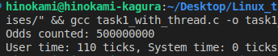

# Implementation
## Task 1
* Create 4 threads, each thread will count number of odd in a range.
  * thread 0 count in (0, 250000000)
  * thread 1 count in (250000001, 500000000)
  * thread 2 count in (500000001, 750000000)
  * thread 3 count in (750000001, 1000000000)

## Result 
1. Without using thread

    

2. Using 4 threads

    

* Using 4 thread consumed more ticks (or time)

## Task 2
* Thread 1 will print a string to verify every 2 seconds
* Thread 2 will print a person identify every 3 seconds