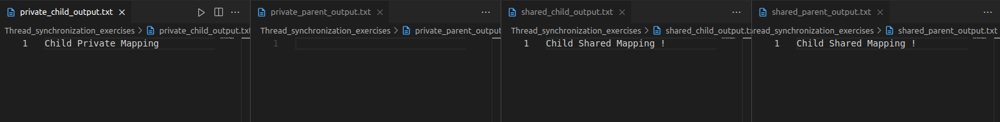

# TASK 1
## 4 threads with semaphore
* Result run in 2 time (with 1 key)

  

* Result run in 2 time (with 4 key)
---
## 4 threads with mutex
* Result run in 2 time

  
---
## 4 threads with shared memory, using mutex
* Result run in 2 time

  

## 4 threads with spin_lock
* Result run in 2 time

  

# TASK 2
## Comparison Idea
1. Private Mapping (MAP_PRIVATE):
    * Changes made by one process are private and do not affect the original memory or other processes' views of the memory.
  
2. Shared Mapping (MAP_SHARED):
    * Changes made by one process are immediately visible to other processes that share the same mapping.

### This program:

* Creates a shared memory object using shm_open.
* Demonstrates private and shared mapping by modifying the memory in child processes.
* Writes the results of memory modifications to separate output files for both parent and child processes.

### Program Workflow
1. Shared Memory Creation:
  * The program creates a shared memory object named /shm_example using shm_open.

2. Private Mapping Demonstration:

  * The parent and child processes map the shared memory object using MAP_PRIVATE.
  * The child process writes "Child Private Mapping" to the mapped memory.
  * The child process writes its memory view to `private_child_output.txt`.
  * The parent process observes `no changes` in its private mapping and writes its memory view to `private_parent_output.txt`.

3. Shared Mapping Demonstration:
  * The parent and child processes map the shared memory object using MAP_SHARED.
  * The child process writes "Child Shared Mapping" to the mapped memory.
  * The child process writes its memory view to `shared_child_output.txt`.
  * The parent process observes `the child's updates` in its shared mapping and writes its memory view to `shared_parent_output.txt`.

## Output

  