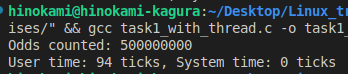

## Implementation
* Create 4 threads, each thread will count number of odd in a range.
  * thread 0 count in (0, 250000000)
  * thread 1 count in (250000001, 500000000)
  * thread 2 count in (500000001, 750000000)
  * thread 3 count in (750000001, 1000000000)

# Result 
1. Without using thread

    

2. Using 4 threads

    

* Using 4 thread gave a better performance, less time consumed.